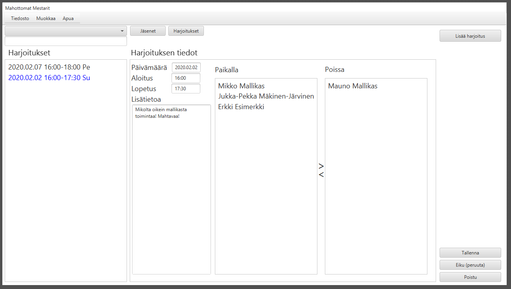

Keväällä 2020 suoritetun Ohjelmointi 2 -kurssin harjoitystyö. Harjoitustyö on tehty parityönä kaverini kanssa. Sovellus on Javalla toteutettu jäsenrekisteri, jossa on mahdollisuus lisätä joukkueita ja hallita niiden jäseniä. Sovelluksella voi myös seurata jäsenten aktiivisuutta esimerkiksi treeneissä.  

